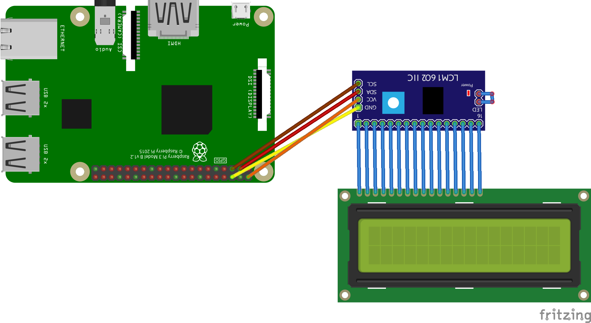

# pi-lcd

## summary

This program utilizes the [rpi-lcd](https://pypi.org/project/rpi-lcd/) library to display text on a 1602 LCD hooked up with an I2C module.

There's a few things built-in already with ```subprocess``` -- ping, RPi temp and memory, and others.

```newdisplay.py``` and ```pythoninterfacing.ino``` contain the server Python code and client Arduino code respectively.

## parts needed

- Arduino MKR WiFi 1010
- Arduino MKR IoT Carrier

- Raspberry Pi (any model, I used a 3B)
- 1602 LCD
- I2C module for said display

## schematics

